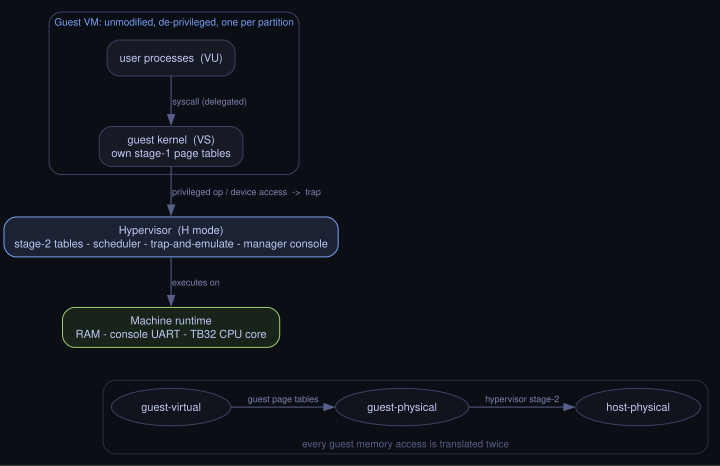

# tb32hv

A Type-1 hypervisor for the TB32 instruction set, built on the virtualization extension in
[libtb32](https://github.com/Tonic-Box/libtb32). It runs unmodified TB32 guest operating systems,
each isolated from the others and from the hypervisor by two-stage address translation.

## Build

```
zig build run     # boot to the manager console
zig build test    # unit tests
```

Requires Zig 0.13.

## Manager console

Single-key commands at the hypervisor prompt:

| Key        | Action                                        |
|------------|-----------------------------------------------|
| `l`        | list VM slots and state                       |
| `c`        | create a VM                                   |
| `k N`      | destroy VM N                                  |
| `N`        | attach to VM N (console routed to that guest) |
| `i N`      | show VM N's saved program counter             |
| `Ctrl + ]` | detach (guest pauses, resumes on re-attach)   |
| `q`        | power off                                     |

The bundled guest prints its id and echoes input; type `x` to make it exit.

## How it works

tb32hv runs as TB32 code in a dedicated hypervisor mode over a small emulated machine. It gives each
guest its own stage-2 page table and trap-and-emulates the devices the guest believes it owns, so
unmodified guests run fully isolated. A guest cannot escape its partition because the final
translation to host memory belongs to the hypervisor rather than the guest.



## License

[MIT](LICENSE)
